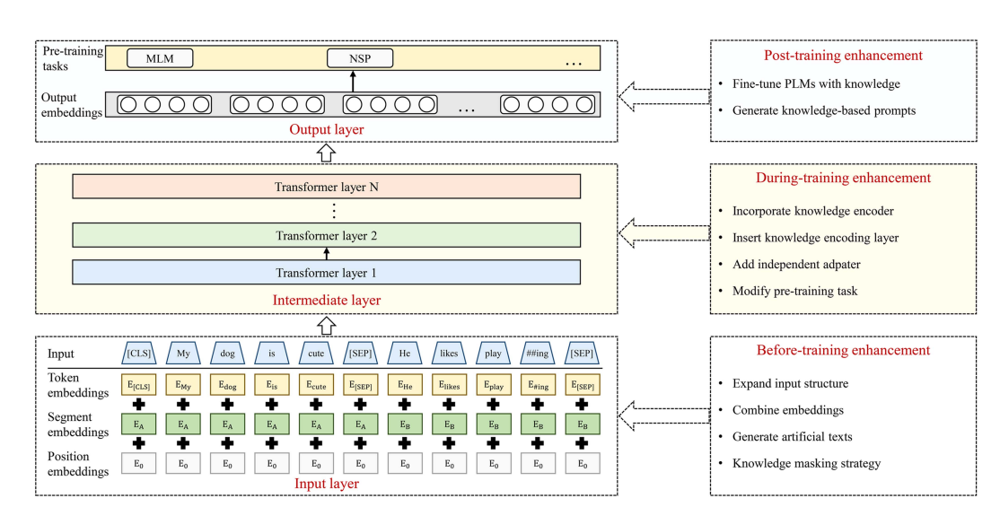
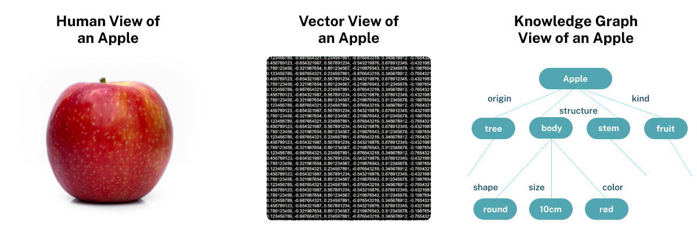
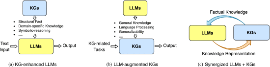
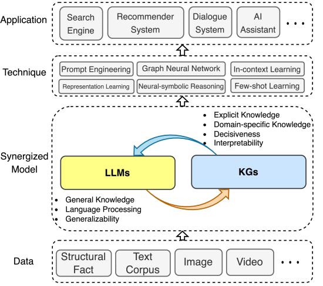
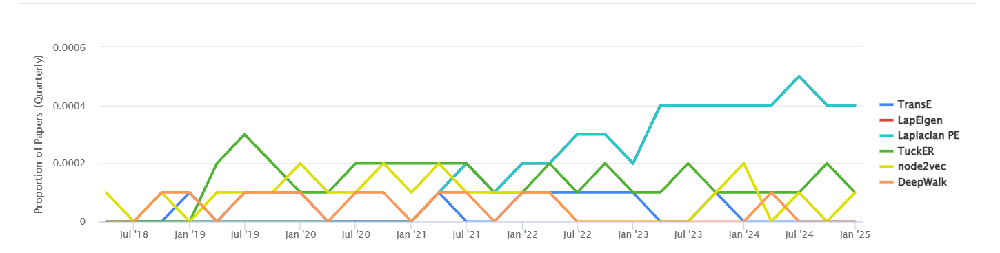
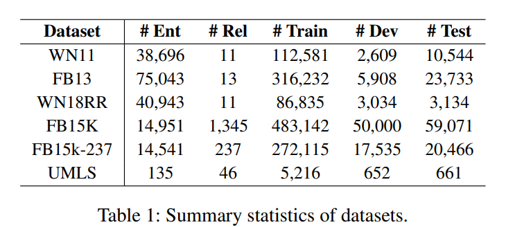

### ❓ Why integrating Knowledge Graphs in LLMs

- LLMs are proefcient at learning probabilistic language patterns and conversational tasks, but they lack the ability of recalling facts while generating knowledgegrounded content.
- To overcome these limitations, one of the proposed method is to integrate knowledge based graphs.
- KGs explicitly express relationships between
  entities and intuitively display the overall structure of knowledge
  and reasoning chains, making them proper choice for knowledge modeling.
- Good overview is provided here: [Give us the Facts: Enhancing Large Language Models With Knowledge Graphs for Fact-Aware Language Modeling](https://ieeexplore.ieee.org/stamp/stamp.jsp?tp=&arnumber=10417790)

---

- Examples where LLMs tend to fail:
  - `Multi-hop reasoning`: which means that the answer, cannot be derrived from single fact.
    ex: Who is the grandmother of Barack Obama's daughters?
  - `Logical reasoning`:
    ex: If John is the brother of Alice, and Alice is the mother of Bob, what is John's relation to Bob?

---

### 🔗 Integration techniques of KGs

- Three types of integration techniques:
  
- We will likely use the first post-training enchancement.

### 🔗 Different represntations of KGs:

Knowledge graphs structure data as entities (nodes) and their explicit relationships (edges), allowing systems to understand how things are connected and reason over this information. They excel at providing context, performing logical reasoning, and supporting complex queries involving multiple entities and relationships.

 

On the other hand, vector databases store data as high-dimensional vectors that capture the semantic meaning of information, focusing on similarity-based retrieval. While vector representations are ideal for fast, scalable searches through unstructured data (like text or images), they lack the explicit, interpretable connections that knowledge graphs provide.

Knowledge graphs (KGs) store structured knowledge as a collection of triples KG={(h,r,t)⊆E×R×E}, where E and R respectively denote the set of entities and relations. Existing knowledge graphs can be classified into four groups based on the stored information:

1. **Encyclopedic Knowledge Graphs**

Encyclopedic knowledge graphs are the most ubiquitous KGs, representing general knowledge of the real world. These graphs are constructed by integrating information from diverse and extensive sources, including human experts, encyclopedias, and databases. 

- **Wikidata**: (Wikidata, derivedFrom, Wikipedia articles)
- **Freebase, Dbpedia, and YAGO**: (derivedFrom, source, Wikipedia)
- **NELL**: (NELL, improvesBy, automatic web extraction)
- **CN-DBpedia** and **Vikidia**: (examplesOf, encyclopedic KGs, non-English languages)
- **Knowledge Occean (KO)7**: (describedAs, largest KG, contains millions of entities and relations in English and Chinese)

2. **Commonsense Knowledge Graphs**

Commonsense knowledge graphs model tacit knowledge about everyday concepts and their relationships.

- **ConceptNet**: (contains, rangeOf, commonsense concepts and relations)
- **ATOMIC** and **ASER**: (focusOn, causal effects, between events)
- **TransOMCS** and **CausalBanK**: (provide, method, automatic commonsense knowledge construction)

3. **Domain-Specific Knowledge Graphs**

These graphs represent knowledge specific to particular domains like medical, biology, and finance, offering higher accuracy and reliability.

- **UMLS**: (contains, biomedical concepts, and their relationships)
- Other examples: (domains, include, finance, geology, biology, chemistry, and genealogy)

4. **Multi-Modal Knowledge Graphs**

Multi-modal knowledge graphs represent facts in various modalities including images, sounds, and videos.

- **IMGpedia**, **MMKG**, and **Richpedia**: (incorporate, both, text and image information)
- Used for tasks such as: (applicableTo, tasks, image-text matching, visual question answering, and recommendation)

### The key representations of knowledge graphs:

1. **Triple-Based Representation**

   - **What it is:** KGs are represented as (Subject, Predicate, Object) triples.
   - **Why it’s useful for LLMs:**
     - Triples can be converted into natural language sentences, which LLMs can easily process.
   - **Example:** (Paris, isCapitalOf, France) → "Paris is the capital of France."
   - **How to integrate:**
     - Convert triples into text and fine-tune LLMs on this textual data.
     - Use triples as additional input features during training or inference.
   - **Challenges:**
     - LLMs may struggle with implicit relationships not explicitly stated in the triples.

2. **Embedding-Based Representation**

   - **What it is:** Entities and relationships are represented as dense vectors (embeddings).
   - **Why it’s useful for LLMs:**
     - Embeddings capture semantic relationships and can be fed into LLMs as additional context.
   - **Example:** Paris → [0.2, 0.8, 0.5], France → [0.3, 0.7, 0.6].
   - **How to integrate:**
     - Use pre-trained KG embeddings (e.g., TransE, ComplEx) as input to LLMs.
     - Combine KG embeddings with word embeddings in the LLM’s input layer.
   - **Challenges:**
     - Requires alignment between KG embeddings and LLM embeddings.

3. **Graph-Based Representation**

   - **What it is:** KGs are represented as nodes (entities) and edges (relationships).
   - **Why it’s useful for LLMs:**
     - Graph structures can be used to guide LLMs in understanding relationships.
   - **Example:** A subgraph about "Paris" can provide context for answering questions about France.
   - **How to integrate:**
     - Use graph neural networks (GNNs) to encode the KG and feed the output into the LLM.
     - Extract subgraphs relevant to the input query and provide them as context to the LLM.
   - **Challenges:**
     - Scalability issues with large KGs.

4. **Textual Representation**

   - **What it is:** KGs are represented as natural language sentences.
   - **Why it’s useful for LLMs:**
     - LLMs are inherently text-based, so textual representations align well with their architecture.
   - **Example:** (Paris, isCapitalOf, France) → "Paris is the capital of France."
   - **How to integrate:**
     - Fine-tune LLMs on KG-derived textual data.
     - Use textual KG representations as prompts or context during inference.
   - **Challenges:**
     - May lose some structural information present in the KG.

5. **Hybrid Representation**

   - **What it is:** Combines multiple representations (e.g., triples + embeddings, graph + text).
   - **Why it’s useful for LLMs:**
     - Leverages the strengths of different representations for better integration.
   - **Example:** Use triples for structured knowledge and embeddings for semantic relationships.
   - **How to integrate:**
     - Use triples for fine-tuning and embeddings for inference.
     - Combine graph-based context with textual prompts.
   - **Challenges:**
     - Requires careful design to avoid redundancy or conflicts.

6. **Prompt-Based Representation**

   - **What it is:** KGs are represented as structured prompts for LLMs.
   - **Why it’s useful for LLMs:**
     - Prompts can guide LLMs to generate answers based on KG knowledge.
   - **Example:** "Given that Paris is the capital of France, answer the following question: What is the capital of France?"
   - **How to integrate:**
     - Design prompts that incorporate KG triples or subgraphs.
     - Use prompt engineering to align KG knowledge with LLM reasoning.
   - **Challenges:**
     - Requires extensive prompt tuning for optimal performance.

7. **Attention-Based Representation**

   - **What it is:** KGs are integrated into LLMs via attention mechanisms.
   - **Why it’s useful for LLMs:**
     - Attention mechanisms allow LLMs to focus on relevant parts of the KG.
   - **Example:** Use attention to weigh KG entities and relationships during text generation.
   - **How to integrate:**
     - Modify the LLM’s attention layers to incorporate KG embeddings or graph structures.
     - Use cross-attention between KG embeddings and LLM hidden states.
   - **Challenges:**
     - Requires architectural changes to the LLM.

  - `Which representation will be the best?`:
   - **Simplicity and Alignment with LLMs:** Opt for Textual or Prompt-Based Representation to convert KG triples into natural language, like turning (Paris, isCapitalOf, France) into "Paris is the capital of France." This approach is easy to implement and requires no architectural changes, though it does lose structural relationships.

  - **Semantic Understanding and ML Compatibility:** Embedding-Based Representation, using models like TransE, ComplEx, or KG-BERT, is ideal. Inject pre-trained KG embeddings into the LLM’s input layer to enhance link prediction and QA capabilities. The challenge here is ensuring alignment between KG and LLM embeddings.

  -  **Critical Structural Relationships:** Graph-Based Representation using subgraphs or GNNs can preserve graph structures and support reasoning, particularly effective when processing queries like "What is the capital of France?" However, this method can be computationally heavy for large KGs.

  - **Cutting-Edge Performance:** Hybrid Representation combines text, embeddings, and graph methods, offering a balanced approach to flexibility and performance. It can be complex to implement but leverages the strengths of multiple representations.

  - **Minimal Training Effort:** Prompt-Based Representation requires minimal setup by engineering prompts with embedded KG knowledge, such as "Given that Paris is the capital of France, answer: What is France's capital?" This method does not require fine-tuning, but its effectiveness is limited to the LLM's prompting capabilities.

The integration of Knowledge Graphs (KGs) and Large Language Models (LLMs) presents a strategic pathway to enhance their respective functionalities and address existing limitations, particularly in areas of factual accuracy and interpretability. The roadmap for this unification encompasses three primary frameworks: KG-enhanced LLMs, LLM-augmented KGs, and a synergized combination of both.
 
- KG-Enhanced LLMs
KG-enhanced LLMs aim to mitigate the common issues of hallucination and the lack of interpretability in LLMs by incorporating structured, factual knowledge from KGs. Researchers have explored embedding KGs into the pre-training and inference stages of LLMs. In the pre-training phase, LLMs assimilate explicit knowledge directly from KGs, which helps them gain a deeper understanding of factual content. During inference, leveraging KGs enables LLMs to access and utilize domain-specific knowledge, enhancing both performance and factual accuracy. Furthermore, KGs are employed to elucidate the reasoning processes of LLMs, adding a layer of interpretability that these models typically lack.

- LLM-Augmented KGs
LLM-augmented KGs focus on using the generative and interpretative capabilities of LLMs to enrich KGs. LLMs process extensive textual data, extracting relevant entities and relationships to fill gaps in KGs or to update and expand existing structures. This methodology not only improves the completeness of KGs but also enhances their utility in real-world applications. The extracted information aids in tasks like KG completion and reasoning, where LLMs interpret and reformat KG data into structures that are easier for both machines and humans to understand.

- Synergized LLMs + KGs
The Synergized LLMs + KGs framework represents a holistic approach, blending the strengths of LLMs and KGs to create a robust, multi-layered architecture. This model leverages both textual and structured data, potentially extending to multi-modal data, to improve the efficacy and applicability of the combined system across various domains, including search engines, recommendation systems, and AI-driven assistance. This synergy not only enhances the individual capabilities of each technology but also creates a more coherent, comprehensive, and reliable system for handling complex, real-world tasks in NLP and beyond.

- `Direct input augmentation`:
  - Change the input to the LLM, to include the KG
  - No retraining of the model.
  - It happens during inference / prediction.
- `Graph embedding based`: apply embedding techniques which converts the graphs to dense vectors.

  - The image represents different embeddings and their usage over time.
  - From all of the methods TransE is only knowledge graph embedding and the other are general embeddings.
    

- `Attention-Based fusion techniques`: Include the attention mechanism in two ways: 1. different weights for the text and KG or 2. different weights for the nodes within the KGs

---

### 📊 Datasets

- Not graph representation :

  - [Complex Web Questions Dataset (Hugging Face)](https://huggingface.co/datasets/drt/complex_web_questions/viewer/complex_web_questions/train?p=1&views%5B%5D=complex_web_questions_train&row=118)
  - [MetaQA](https://github.com/yuyuz/MetaQA) This one contatins 1,2,3-hop data, useful for testing.

- Graph-based datasets:

  - [DBpedia](https://www.dbpedia.org/resources/sparql/)
  - [Wikidata](https://www.wikidata.org/wiki/Wikidata:Main_Page)
  - additionally we can try fusion of graphs from different sources.
  - [ArangoDB](https://arangodb.com)
  
     ArangoDB is a multi-model NoSQL database that combines the capabilities of graph, document, and key/value databases into a single system. It’s designed for flexibility, scalability, and high performance, making it a popular choice for applications that require handling complex data relationships and diverse data types
- Main idea: pair questions with KGs

---

### 📚 Related work:

- In most of the papers, they start with some baseline models like BERT, T-5, and than compare their integration of KGs with other integration frameworks.

- [KG-BERT: BERT for Knowledge Graph Completion
  ](https://arxiv.org/pdf/1909.03193) Explained how BERT is fine-tuned for knlowedge graph prediction, not directly related to our topic. We can use the following KGs benchmark datasets, as used in this paper:
  

- [DRAGON Deep Bidirectional Language-Knowledge Graph Pretraining:](https://arxiv.org/pdf/2210.09338)

  - Eeach input is represented as pairs of text segments and relevant KG subgraphs. The model bidirectionally fuses information from both the text and the KG.
  - How the KGs are generated:
    main idea starting with a base KG, `ConceptNet` is used in the general domain, and the `UMLS KG` is used in the biomedical domain. Segments of the text input are mapped to corresponding nodes in the base KG, connecting them in this step. A relevant subgraph is extracted from the base KG, centered around these nodes. This subgraph is then further fused with the input text
